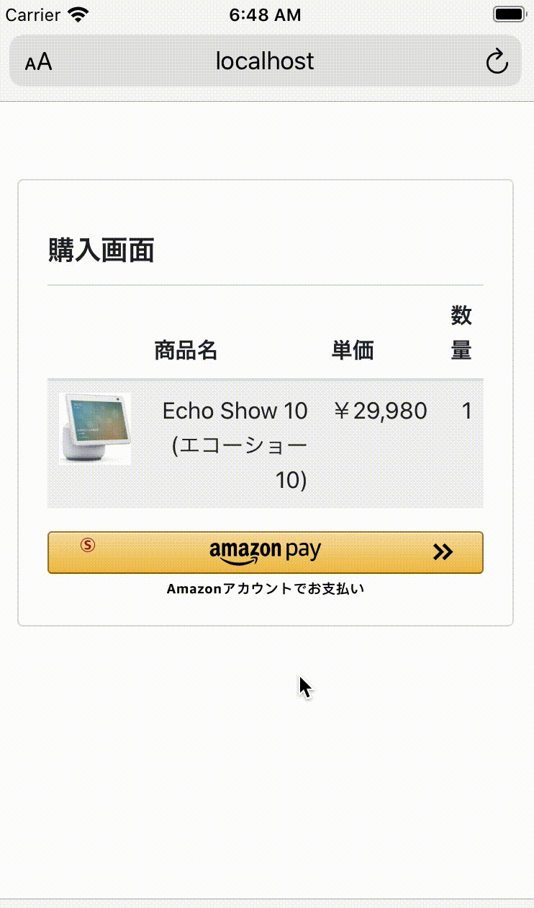

# Ruby版 Amazon Pay v2 サンプルアプリケーション
下記Amazon Pay v2の、Ruby版サンプルアプリケーションです。  
http://amazonpaycheckoutintegrationguide.s3.amazonaws.com/amazon-pay-checkout/introduction.html

## 動作条件
Ruby version: 2.0.0 〜 2.2.10  
※ 2.3.0以上の方は[こちら](https://github.com/amazonpay-labs/amazonpay-sample-ruby-v2).  

OpenSSL: 下記コマンドの実行が成功すること.
```sh
% echo 'Test' | openssl dgst -sha256 -sign '#{privateKeyFile}' -sigopt rsa_padding_mode:pss -sigopt rsa_pss_saltlen:20
XXXXXXXXXXXX.....
```
注意点１: '#{privateKeyFile}' → SellerCentralで取得したprivate keyファイルのパス  
注意点２: このコマンドはバイナリデータを返すため、成功後に表示される結果が文字化けしたように見えるので、注意  

実行に失敗した場合には、opensslを新しいバージョンにupgradeする.  

## 概要
本アプリケーションでは、下記のようにAmazon Payでの単純な購入フローを実行するサンプルを提供しています。  

  

## インストール

### リポジトリのclone
本リポジトリをcloneします。  
```sh
git clone https://github.com/amazonpay-labs/amazonpay-sample-ruby2_2-v2.git

# cloneしたリポジトリへ移動
cd amazonpay-sample-ruby2_2-v2
```

### Seller Centralでのアプリケーション作成・設定
下記コマンドにて、Rubyスクリプトを実行します。  
```sh
ruby keys/init.rb
```

keysディレクトリ配下に、下記のファイルが生成されます。  
  - keyinfo.rb  
  - privateKey.pem  

[Seller Central](https://sellercentral.amazon.co.jp/)にて、本サンプル用にアプリケーションを用意し、[こちら](https://amazonpaycheckoutintegrationguide.s3.amazonaws.com/amazon-pay-checkout/get-set-up-for-integration.html#4-get-your-public-key-id)を参考に、Merchant ID, Public Key ID, Store ID, Private Keyを取得し、それぞれ下記にコピーします。
  * Merchant ID: keys/keyinfo.rb の MERCHANT_ID
  * Public Key ID: keys/keyinfo.rb の PUBLIC_KEY_ID
  * Store ID: keys/keyinfo.rb の STORE_ID
  * Private Key: keys/privateKey.pem

### 依存モジュールのインストール
本ディレクトリにて、RubyGemsを使用して下記のコマンドを実行し、依存モジュールをインストールします。

```sh
gem install sinatra -v 1.4.8
```

## サーバーの起動
本ディレクトリにて、下記コマンドを実行します。
```sh
ruby app.rb
```

[http://localhost:4567/](http://localhost:4567/) にアクセスして、動作を確認します。

# 本アプリケーションの構成

本アプリケーションは主に下記3つのrbファイルで構成されています。  

## app.rb
Webアプリの本体です。[Sinatra](http://sinatrarb.com/)で実装されており、100行弱程度です。

## keys/keyinfo.rb
各種設定値のみが定義された設定ファイルです。

## libs/signature.rb
Amazon Pay APIの呼出方法を示したサンプルで、コード部分が約120行あります。  
ファイルの先頭にサンプルコードの使い方を英語で示しており、下記はその日本語訳です。 

--- 

最初に、下記のようにAmazonPayClientをインスタンス化します。:  
```ruby
    client = AmazonPayClient.new {
        :public_key_id => 'XXXXXXXXXXXXXXXXXXXXXXXX', # SellerCentralで取得したpublick key ID
        :private_key_path => './keys/privateKey.pem', # SellerCentralで取得したprivate keyファイルへのパス
        :region => 'jp', # 'na', 'eu', 'jp'が指定できます
        :sandbox => true
    }
```

### ボタンのSignatureを生成する場合
下記パラメタを指定して、'generate_button_signature'を呼び出します。
 - payload: APIに渡すpayload。JSON string でも Hashインスタンス でも可。  

参照: http://amazonpaycheckoutintegrationguide.s3.amazonaws.com/amazon-pay-checkout/add-the-amazon-pay-button.html#3-sign-the-payload

例:  
```ruby
    signature = client.generate_button_signature {
        :webCheckoutDetails => {
            :checkoutReviewReturnUrl => 'http://example.com/review'
        },
        :storeId => 'amzn1.application-oa2-client.xxxxxxxxxxxxxxxxxxxxxxxxxxxxxxx'
    }
```

### その他のAPIの呼び出し

下記パラメタを指定して、'call_api'を呼び出します。  
 - url_fragment: API呼出のURLの末尾部分。 例) 'https://pay-api.amazon.com/:environment/:version/checkoutSessions/' の場合、「checkoutSessions」
 - method: API呼出のHTTP method
 - (Optional) payload: API呼出のrequest payload。JSON string でも Hashインスタンス でも可。  
 - (Optional) headers: API呼出のHTTP header。 例) {header1: 'value1', header2: 'value2'}
 - (Optional) query_params: API呼出のquery parameter。 例) {param1: 'value1', param2: 'value2'}  
 API呼出のresponseが返却される。  

例1: [Create Checkout Session](http://amazonpaycheckoutintegrationguide.s3.amazonaws.com/amazon-pay-api-v2/checkout-session.html#create-checkout-session)  

```ruby
    response = client.api_call ("checkoutSessions", "POST",
        :payload => {
            :webCheckoutDetails => {
                :checkoutReviewReturnUrl => "https://example.com/review"
            },
            :storeId => "amzn1.application-oa2-client.xxxxxxxxxxxxxxxxxxxxxxxxxxxxxxx"
        },
        :headers => {'x-amz-pay-idempotency-key' => SecureRandom.hex(10)}
    )
```

例2: [Get Checkout Session](http://amazonpaycheckoutintegrationguide.s3.amazonaws.com/amazon-pay-api-v2/checkout-session.html#get-checkout-session)  

```ruby
    response = client.api_call ("checkoutSessions/#{amazon_checkout_session_id}", 'GET')
```
